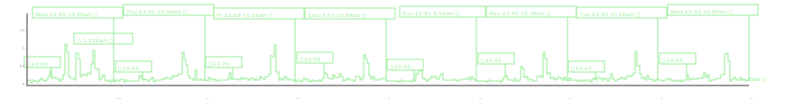

# octopus-graph

A bit hacky to try and avoid too many dependencies, I might clean this up.

1. Sign up to octopus energy https://share.octopus.energy/cute-elm-487
2. See https://octopus.energy/dashboard/developer/ to get your key etc
3. `curl -u "your-key-here:" "https://api.octopus.energy/v1/electricity-meter-points/your-mpan/meters/your-serial-number/consumption/?period_from=2022-06-12T00:00:00Z" > ./data/electricity_this_week.json`
4. `./scripts/octopus.js > images/octopus.svg # it's just html`

